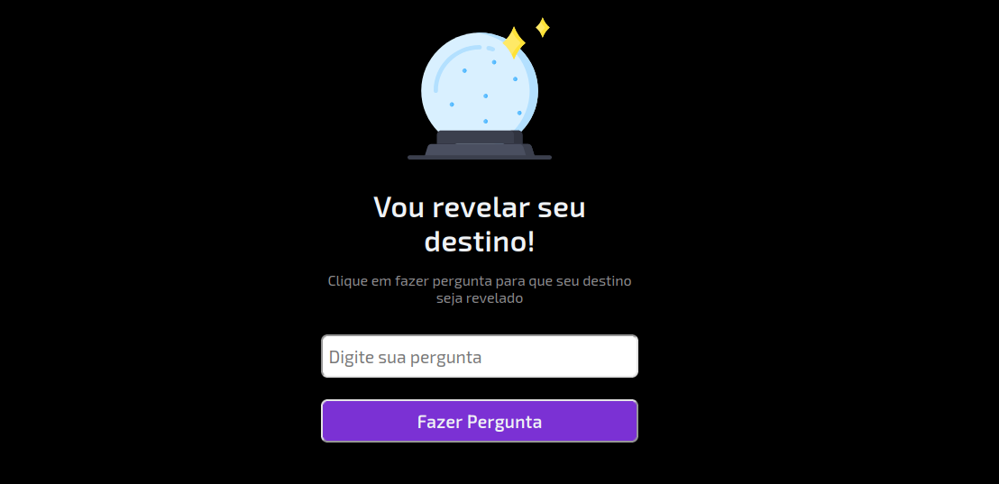

  

<h1 align="center">
  
  
  
  
</h1>
 

## 📌 Sobre 

Projeto desenvolvido na Maratona Explorer da [Rocketseat](https://app.rocketseat.com.br).

Se trata de um aplicativo onde o usuário faz uma pergunta e seu destino é revelado.

 

  

 

## 👩‍💼 Autora

<b>Nádia Ligia, budding back-end developer.</b>

&nbsp;
&nbsp;

